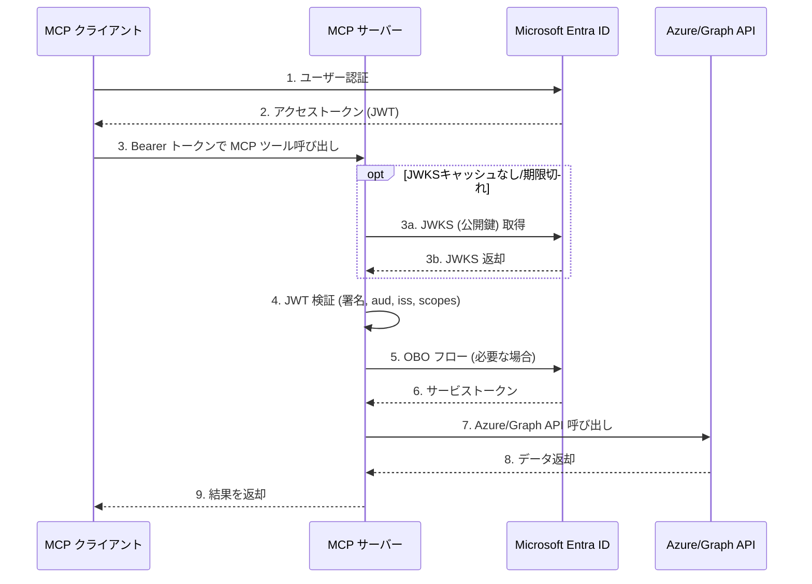

# Entra ID Protected MCP Server

> Microsoft Entra ID (旧 Azure AD) 認証で保護された Model Context Protocol (MCP) サーバー

Microsoft Entra ID のアクセストークン検証機能を備えた FastMCP サーバーです。認証済みユーザーのクレーム情報取得、Azure リソース管理、Microsoft Graph API 統合、ロールベースアクセス制御 (RBAC) などの機能を提供します。

## ✨ 主な機能

- 🔐 **Microsoft Entra ID 認証**: JWT トークンの署名検証、audience/issuer 検証、スコープ検証
- 👤 **ユーザー情報取得**: アクセストークンから詳細なユーザークレーム情報を抽出
- ☁️ **Azure リソース統合**: On-Behalf-Of (OBO) フローによる Azure Virtual Machines 一覧取得
- 📊 **Microsoft Graph 統合**: ユーザープロフィール情報の取得と最適化されたクエリ
- 🎭 **ロールベースアクセス制御**: トークンの roles クレームに基づく段階的な情報アクセス制御
- 🔧 **拡張可能な設計**: 新しい MCP ツールを簡単に追加できるモジュール構造

## 📑 目次

- [機能概要](#機能概要)
- [技術スタック](#技術スタック)
- [ディレクトリ構成](#ディレクトリ構成)
- [必要要件](#必要要件)
- [セットアップ](#セットアップ)
- [実行方法](#実行方法)
- [認証フロー概要](#認証フロー概要)
- [提供ツール](#提供ツール)
- [デバッグとテスト](#デバッグとテスト)
- [開発ガイド](#開発ガイド)

## 技術スタック

- **Python**: 3.12+
- **MCP Framework**: [FastMCP](https://github.com/jlowin/fastmcp) 2.14.5+
- **認証**: 
  - `python-jose` - JWT 検証
  - `msal` - Microsoft Authentication Library (OBO フロー)
  - `cryptography` - 暗号化処理
- **Azure SDK / Microsoft Graph SDK**: 
  - `azure-mgmt-compute` - Azure VM 管理
  - `msgraph-sdk` - Microsoft Graph API クライアント
- **パッケージ管理**: [uv](https://github.com/astral-sh/uv)

## 機能概要

### 🔐 認証機能
- Microsoft Entra ID の JWT トークンの包括的な検証
  - 署名検証 (JWKS を使用)
  - `aud` (audience) および `iss` (issuer) の検証
  - 必須スコープの検証 (`ENTRA_REQUIRED_SCOPES`)
- FastMCP ベースの MCP サーバー
  - デフォルト: `streamable-http` トランスポートで `localhost:8000` で待ち受け
  - 環境変数による柔軟な設定

### 🛠️ 提供ツール

#### ユーザー情報
- **`get_user_info`**: 認証済みユーザーのクレーム情報を取得
  - `subject`, `tenant_id`, `user_principal_name`, `email`, `name`, `roles`, `scopes` など

#### Azure 統合
- **`list_azure_vms`**: Azure Virtual Machines 一覧取得
  - OBO フローで Azure Resource Manager 用トークンに交換
  - 指定サブスクリプション内の VM 情報を返却

#### Microsoft Graph 統合
- **`get_graph_me`**: ユーザーの完全なプロフィール情報を取得
  - OBO フローで Graph API 用トークンに交換
- **`get_graph_me_with_select_query`**: 最適化されたフィールド取得
  - `$select` クエリで必要なフィールドのみを取得
  - ネットワーク効率と応答速度を最適化

#### ロールベースアクセス制御 (RBAC)
- **`get_company_info`**: ロールに応じた企業情報の段階的提供
  - **ロールなし**: 基本的な公開情報
  - **User ロール**: 詳細な公開情報
  - **Auditor ロール**: 監査情報を含む
  - **Admin ロール**: 機密情報を含むすべての情報
- **`get_sensitive_data`**: Admin ロール専用の機密データ
  - Admin ロール保持者のみアクセス可能
  - 権限不足時は `AuthenticationError` を発生
- **`list_available_resources`**: アクセス可能なリソース一覧
  - 現在のユーザーのロールでアクセス可能なリソースをリストアップ
  - 権限確認に便利

## ディレクトリ構成

```
entra-id-protected-mcp-server/
├── .vscode/
│   ├── launch.json                 # VS Code デバッグ設定
│   └── settings.json               # VS Code エディタ設定
├── src/
│   ├── main.py                     # エントリーポイント
│   ├── auth/                       # 認証関連
│   │   ├── __init__.py
│   │   ├── entra_auth_provider.py # Microsoft Entra ID トークン検証
│   │   ├── obo_client.py          # On-Behalf-Of フロー実装
│   │   └── claims_helpers.py      # クレーム情報抽出ヘルパー
│   ├── common/                     # 共通ユーティリティ
│   │   ├── __init__.py
│   │   ├── config.py              # 環境変数設定
│   │   ├── logging_config.py      # ログ設定管理
│   │   └── utils.py               # ヘルパー関数
│   └── tools/                      # MCP ツール
│       ├── __init__.py            # ツール自動登録
│       ├── userinfo.py            # ユーザー情報ツール
│       ├── azure_vm.py            # Azure VM 管理ツール
│       ├── graph_user.py          # Graph API ツール
│       └── role_based_info.py     # RBAC ツール
├── .env.example                    # 環境変数テンプレート
├── LOGGING_GUIDE.md                # ログ設定の詳細ガイド
├── pyproject.toml                  # プロジェクト設定と依存関係
├── uv.lock                         # uv のロックファイル
└── README.md                       # このファイル
```

### 主要モジュールの役割

| モジュール | 役割 |
|----------|------|
| `main.py` | FastMCP サーバーの初期化と起動。環境設定の読み込み、認証プロバイダの設定、ツールの登録を行う |
| `auth/entra_auth_provider.py` | JWT トークンの検証。JWKS を取得して署名検証、audience/issuer/スコープのチェックを実施 |
| `auth/obo_client.py` | MSAL を使用した On-Behalf-Of フローの実装。ユーザートークンをサービストークンに交換 |
| `auth/claims_helpers.py` | アクセストークンからユーザー情報・ロール・スコープを抽出するヘルパー関数群 |
| `common/config.py` | 環境変数の一元管理。Microsoft Entra ID 設定、ログレベル、MCP サーバー設定を提供 |
| `common/logging_config.py` | 3 種類のログレベル（アプリ・認証・MCP サーバー）を個別制御する設定クラス |
| `common/utils.py` | スコープのパース、Graph モデルのシリアライズなどのヘルパー関数 |
| `tools/__init__.py` | ツールの自動検出と登録。`tools/` 配下のモジュールを動的にロード |
| `tools/userinfo.py` | ユーザー情報取得ツール (`get_user_info`) |
| `tools/azure_vm.py` | Azure VM 管理ツール (`list_azure_vms`) |
| `tools/graph_user.py` | Microsoft Graph ツール (`get_graph_me`, `get_graph_me_with_select_query`) |
| `tools/role_based_info.py` | RBAC ツール (`get_company_info`, `get_sensitive_data`, `list_available_resources`) |

## 必要要件

- **Python**: 3.12 以降
- **Microsoft Entra ID テナント**
  - API 用のアプリケーション登録
  - アクセストークンを発行できる環境（SPA / Web アプリ / CLI など）
- **パッケージマネージャ**: [uv](https://github.com/astral-sh/uv) (推奨)

## セットアップ

### 1. Microsoft Entra ID のアプリ登録とスコープ作成

このサーバーを使用する前に、Microsoft Entra ID でアプリケーションを登録する必要があります。このサーバーは Microsoft Entra ID v2.0 トークン (`requestedAccessTokenVersion=2`) を使用します。

#### 1-1. Azure ポータルでアプリ登録

1. Azure ポータル → **「Microsoft Entra ID」** → **「アプリの登録」** → **「新規登録」**
2. 任意の名前を設定し、**「登録」** をクリック
3. 以下の情報をメモしておきます（後ほど `.env` ファイルに設定します）:
   - **ディレクトリ (テナント) ID** → 後で `ENTRA_TENANT_ID` として設定
   - **アプリケーション (クライアント) ID** → 後で `ENTRA_APP_CLIENT_ID` として設定

#### 1-2. アクセストークンバージョンを v2.0 に設定

1. 対象アプリの **「マニフェスト」** メニューを開く
2. `requestedAccessTokenVersion` を `2` に設定して保存

```json
{
  "requestedAccessTokenVersion": 2
}
```

#### 1-3. アプリケーション ID URI の設定

1. **「Expose an API (API の公開)」** に移動
2. **「Set」** または **「Application ID URI の設定」** をクリック
3. URI を設定 (例: `api://<アプリケーションID>`)
4. この値をメモしておきます（後で `ENTRA_APP_CLIENT_ID` として `.env` に設定します）

#### 1-4. スコープ (`access_as_user`) の作成

1. **「Expose an API」** → **「Add a scope (スコープの追加)」**
2. 以下を入力:
   - **Scope name**: `access_as_user`
   - **Who can consent**: `Admins and users`
   - **Display name / Description**: 適切な説明を入力
3. **「Enabled」** がオンであることを確認して保存
4. スコープ名 `access_as_user` をメモしておきます（後で `ENTRA_REQUIRED_SCOPES` として `.env` に設定します）

#### 1-5. クライアント シークレットの作成 (OBO フロー用)

1. **「証明書とシークレット」** → **「新しいクライアント シークレット」**
2. 説明と有効期限を設定して作成
3. シークレットの **値** をコピーしてメモしておきます（後で `ENTRA_APP_CLIENT_SECRET` として `.env` に設定します）

> **⚠️ 重要**: シークレットの値は作成時のみ表示されます。必ずメモしておいてください。

#### 1-6. API アクセス許可の追加

OBO フローで Azure や Graph API にアクセスする場合:

1. **「API のアクセス許可」** → **「アクセス許可の追加」**
2. 以下を追加:
   - **Microsoft Graph**: `User.Read` (委任されたアクセス許可)
   - **Azure Service Management**: `user_impersonation` (委任されたアクセス許可)
3. **「管理者の同意を与えます」** をクリック (管理者権限が必要)

### 2. Microsoft Entra ID でのアプリロール登録 (オプション)

ロールベースアクセス制御 (RBAC) を実装する場合は、アプリロールを定義してユーザーに割り当てます。RBAC 機能が不要な場合は、このステップをスキップできます。

#### 2-1. Azure ポータルでアプリロールを作成

1. Azure ポータル → **「Microsoft Entra ID」** → **「アプリの登録」**
2. 対象のアプリケーションを選択
3. 左側メニューから **「アプリ ロール」** を選択
4. **「アプリ ロールの作成」** をクリック

#### 2-2. ロール定義の例

以下の3つのロールを作成します:

| フィールド | Admin | Auditor | User |
|----------|-------|---------|------|
| **表示名** | Admin | Auditor | User |
| **値** | `Admin` | `Auditor` | `User` |
| **説明** | 管理者権限。すべての情報にアクセス可能 | 監査担当者権限。監査情報にアクセス可能 | 一般ユーザー権限。基本情報にアクセス可能 |
| **許可されるメンバーの種類** | ☑ 両方（ユーザー/グループ + アプリケーション） | ☑ 両方 | ☑ 両方 |
| **有効化** | ☑ 有効 | ☑ 有効 | ☑ 有効 |

> **注**: **値** フィールドがアクセストークンの `roles` クレームに含まれます。

#### 2-3. ユーザーにロールを割り当て

1. Azure ポータル → **「Microsoft Entra ID」** → **「エンタープライズ アプリケーション」**
2. 対象のアプリケーションを検索して選択
3. **「ユーザーとグループ」** → **「ユーザーまたはグループの追加」**
4. ユーザーまたはグループを選択
5. **「ロールの選択」** で作成したロール (Admin, Auditor, User) を選択
6. **「割り当て」** をクリック

#### 2-4. トークンでロールを確認

ロールが正しく割り当てられると、JWT の `roles` クレームに含まれます:

```json
{
  "aud": "api://your-app-id",
  "iss": "https://login.microsoftonline.com/tenant-id/v2.0",
  "sub": "user-object-id",
  "roles": ["Admin", "User"],
  "scp": "access_as_user"
}
```

トークンは [jwt.ms](https://jwt.ms) や [jwt.io](https://www.jwt.io/) でデコードして確認できます。

> **⚠️ 注意事項**:
> - ロールの割り当てには **テナント管理者権限** が必要な場合があります
> - ロール割り当て後、ユーザーは **再ログイン** して新しいトークンを取得する必要があります
> - 既存のトークンには新しいロール情報は含まれません

### 3. リポジトリのクローン

```bash
git clone <this-repo-url>
cd entra-id-protected-mcp-server
```

### 4. 依存パッケージのインストール

このプロジェクトは [uv](https://github.com/astral-sh/uv) を使用してパッケージ管理を行います。

```bash
# uv がインストールされていない場合
pip install uv

# プロジェクト依存関係のインストール
uv sync
```

> **注**: `uv` は自動的に仮想環境 (`.venv`) を管理します。手動で `python -m venv` を実行する必要はありません。

### 5. 環境変数の設定

`.env.example` を `.env` にコピーし、環境に合わせて値を設定します。

```bash
# Windows (PowerShell)
Copy-Item .env.example .env

# Linux/macOS
cp .env.example .env
```

`.env` の設定例:

```dotenv
# Microsoft Entra ID 認証設定
ENTRA_TENANT_ID=your-tenant-id-here
ENTRA_APP_CLIENT_ID=your-client-or-api-id-here
ENTRA_REQUIRED_SCOPES=access_as_user
ENTRA_APP_CLIENT_SECRET=your-mcp-api-client-secret-here

# ログレベル設定（3 種類を個別制御可能）
# APP_LOG_LEVEL: アプリ・Azure SDK・Microsoft Graph SDK のログレベル
APP_LOG_LEVEL=INFO
# AUTH_LOG_LEVEL: Entra 認証・MSAL のログレベル（未指定なら APP_LOG_LEVEL と同じ）
AUTH_LOG_LEVEL=INFO
# MCP_SERVER_LOG_LEVEL: MCP サーバーのログレベル（未指定なら APP_LOG_LEVEL と同じ）
MCP_SERVER_LOG_LEVEL=INFO

# MCP サーバー設定
MCP_TRANSPORT=streamable-http
MCP_HOST=localhost
MCP_PORT=8000
```

上記の手順1で取得した値を設定してください。

## 実行方法

### VS Code から起動（推奨）

VS Code の launch.json に MCP サーバー起動設定が含まれています。

1. VS Code でプロジェクトを開く
2. `.env` ファイルを作成して環境変数を設定
3. 実行とデバッグビューで **「Run MCP Server」** を選択
4. F5 または「デバッグの開始」で起動

### コマンドラインから起動

```bash
# Windows (PowerShell)
$env:PYTHONPATH = "$PWD/src"
uv run python src/main.py

# Linux/macOS (Bash)
export PYTHONPATH="$PWD/src"
uv run python src/main.py
```

サーバーが起動すると、以下のログが表示されます:

```
INFO MCP Log Level: INFO
INFO Entra Tenant ID: xxxxxxxx-xxxx-xxxx-xxxx-xxxxxxxxxxxx
INFO Entra App Client ID: api://xxxxxxxx-xxxx-xxxx-xxxx-xxxxxxxxxxxx
INFO JWKS fetched: keys=5
INFO Server started on localhost:8000
```

## 認証フロー概要



### 詳細フロー

1. **クライアント認証**: MCP クライアント（エージェント/エディタ拡張など）が Microsoft Entra ID からアクセストークンを取得
2. **トークン送信**: `Authorization: Bearer <token>` ヘッダーで MCP サーバーに送信
3. **トークン検証**: `EntraIDAuthProvider` が以下を検証
   - 署名検証 (Entra の JWKS を取得して JOSE で検証)
   - `audience` が `ENTRA_APP_CLIENT_ID` と一致
   - `issuer` がテナントに対応した URL
   - 必須スコープ (`ENTRA_REQUIRED_SCOPES`) を満たしているか
4. **コンテキスト保存**: 検証成功時、FastMCP の `AccessToken` としてトークン情報をコンテキストに保存
5. **ツール実行**: MCP ツールは `get_access_token()` を通じてクレームにアクセス
6. **OBO フロー** (必要な場合): Azure/Graph API へのアクセスには、ユーザートークンをサービストークンに交換
7. **エラーハンドリング**: トークンが無効・期限切れ・スコープ不足の場合は `AuthenticationError` が発生

## 提供ツール

### 👤 `get_user_info`

認証済みユーザーのアクセストークンから代表的なクレームを抽出して返します。

**返却フィールド例**:
```json
{
  "subject": "xxxxxxxx-xxxx-xxxx-xxxx-xxxxxxxxxxxx",
  "client_id": "xxxxxxxx-xxxx-xxxx-xxxx-xxxxxxxxxxxx",
  "tenant_id": "xxxxxxxx-xxxx-xxxx-xxxx-xxxxxxxxxxxx",
  "user_principal_name": "user@contoso.com",
  "email": "user@contoso.com",
  "name": "山田 太郎",
  "roles": ["Admin", "User"],
  "scopes": ["access_as_user"],
  "issued_at": 1707868800,
  "expires_at": 1707872400
}
```

### ☁️ `list_azure_vms`

指定したサブスクリプション内の Azure Virtual Machines 一覧を取得します。

**引数**:
- `subscription_id` (string): Azure サブスクリプション ID

**動作**:
1. ユーザートークンを OBO フローで Azure Resource Manager 用トークンに交換
2. `azure-mgmt-compute` SDK で VM 一覧を取得
3. VM の基本情報 (id, name, location, type, tags) を返却

**返却例**:
```json
[
  {
    "id": "/subscriptions/.../resourceGroups/rg1/providers/Microsoft.Compute/virtualMachines/vm1",
    "name": "vm1",
    "location": "eastus",
    "type": "Microsoft.Compute/virtualMachines",
    "tags": {"environment": "production"}
  }
]
```

### 📊 `get_graph_me`

Microsoft Graph API を使用して認証済みユーザーの完全なプロフィール情報を取得します。

**動作**:
1. OBO フローで Graph API 用トークンに交換 (スコープ: `https://graph.microsoft.com/.default`)
2. `msgraph-sdk` で `/v1.0/me` エンドポイントを呼び出し
3. ユーザーのすべてのプロフィールフィールドを返却

**返却フィールド例**:
```json
{
  "id": "xxxxxxxx-xxxx-xxxx-xxxx-xxxxxxxxxxxx",
  "displayName": "山田 太郎",
  "mail": "yamada@contoso.com",
  "userPrincipalName": "yamada@contoso.com",
  "jobTitle": "Senior Engineer",
  "department": "Engineering",
  "officeLocation": "Tokyo Office"
}
```

### 📊 `get_graph_me_with_select_query`

必要なフィールドのみを指定してユーザープロフィール情報を取得します（最適化版）。

**引数**:
- `select` (string): カンマ区切りのフィールドリスト
  - デフォルト: `"displayName,mail,id,officeLocation,jobTitle"`

**メリット**:
- ネットワーク転送量の削減
- 応答時間の短縮
- 必要な情報のみを効率的に取得

**使用例**:
```python
# 名前とメールのみ取得
result = await get_graph_me_with_select_query(select="displayName,mail")

# ID、役職、部署のみ取得
result = await get_graph_me_with_select_query(select="id,jobTitle,department")
```

### 🎭 `get_company_info`

ロールに基づいて段階的に企業情報を返します（RBAC の実装例）。

**アクセスレベル**:

| ロール | アクセス可能な情報 |
|--------|-----------------|
| **ロールなし** | 基本的な公開情報（会社名、設立年、連絡先など） |
| **User** | 詳細な公開情報（従業員数範囲、株式情報、認証情報など） |
| **Auditor** | 監査情報（実際の従業員数、年間売上、監査レポートなど） |
| **Admin** | 機密情報（未公開プロジェクト、詳細財務、戦略計画、役員報酬など） |

**返却例 (Admin ロール)**:
```json
{
  "access_level": "admin",
  "user_roles": ["Admin", "User"],
  "company_name": "Contoso Corporation",
  "public_info": { ... },
  "audit_info": {
    "employee_count": 2847,
    "annual_revenue_usd": 450000000
  },
  "confidential_info": {
    "unreleased_projects": [...],
    "financial_details": {...},
    "strategic_plans": {...}
  }
}
```

### 🔒 `get_sensitive_data`

Admin ロールを持つユーザーのみがアクセスできる機密データを取得します。

**必要ロール**: `Admin`

**エラーハンドリング**:
```python
try:
    data = await get_sensitive_data()
except AuthenticationError as e:
    # insufficient_role: 'Admin' role required, but user has ['User']
    print(f"アクセス拒否: {e}")
```

### 📋 `list_available_resources`

現在のユーザーのロールでアクセス可能なリソースとツールを一覧表示します。

**返却例**:
```json
{
  "user_info": {
    "name": "山田 太郎",
    "user_id": "xxx-xxx-xxx",
    "roles": ["Admin", "User"]
  },
  "accessible_resources": [
    {
      "resource": "公開会社情報",
      "description": "会社の基本的な公開情報",
      "access_level": "public",
      "tools": ["get_company_info"]
    },
    {
      "resource": "機密情報",
      "description": "未公開プロジェクト、詳細財務情報",
      "access_level": "admin",
      "tools": ["get_company_info", "get_sensitive_data"]
    }
  ]
}
```

## デバッグとテスト

### VS Code でのデバッグ実行

このリポジトリには VS Code 用のデバッグ構成 (`.vscode/launch.json`) が含まれています。

#### 事前準備

1. `.env` を作成し、必要な値を設定
2. `uv sync` で依存関係をインストール
3. VS Code の Python 拡張機能をインストール

#### Python インタープリターの選択

1. コマンドパレット (Ctrl+Shift+P / Cmd+Shift+P) を開く
2. **「Python: Select Interpreter」** を入力・選択
3. `.venv` 内の Python を選択
   - 例: `Python 3.x.x ('.venv': venv) ./.venv/Scripts/python`

> `.venv` が表示されない場合は、`settings.json` に以下を追加:
> ```json
> {
>   "python.venvPath": ".",
>   "python.venvFolders": [".venv"]
> }
> ```

#### デバッグ起動

1. VS Code でプロジェクトを開く
2. 実行とデバッグビューで **「Run MCP Server」** を選択
3. F5 または **「デバッグの開始」** で起動

ブレークポイントを設定してトークン検証やツール実行をステップ実行できます。

### MCP Inspector でのテスト

MCP Inspector を使用して対話的にツールをテストできます。

#### 前提条件

- Node.js (推奨: v22.7.5 以降)
- MCP サーバーが起動中 (`localhost:8000`)

#### 1. アクセストークンの取得

MCP Inspector でテストする前に、Azure CLI を使用してアクセストークンを取得します。

```powershell
# アプリケーション ID URI を指定
$RESOURCE = "api://xxxxxxxx-xxxx-xxxx-xxxx-xxxxxxxxxxxx"

# スコープを指定してログイン
az login --scope "$RESOURCE/access_as_user"

# アクセストークンを取得
$token = az account get-access-token --resource $RESOURCE --query accessToken -o tsv

# トークンの内容を確認 (オプション)
Write-Host "Token: $token"
```
> **💡 ヒントその 1**: ゲストユーザーでサインインをする場合は、 az login コマンドに --tenant オプションをつけてアクセス先のテナントのテナントID も指定してください

> **💡 ヒントその 2**: 取得したトークンは [jwt.ms](https://jwt.ms) や [jwt.io](https://www.jwt.io/) でデコードして内容を確認できます。`roles`、`scp` などのクレームが正しく含まれているか確認してください。

#### 2. MCP Inspector の起動と設定

1. VS Code の実行とデバッグビューで **「Run MCP Inspector」** を選択
2. F5 または **「デバッグの開始」** で起動
3. ブラウザで MCP Inspector が開きます
4. MCP サーバー接続を設定:
   - **トランスポート**: `HTTP` / `streamable-http`
   - **URL**: `http://localhost:8000/mcp`
   - **Authentication**: `Authorization: Bearer <access_token>`
     - `<access_token>` には、上記手順で取得したトークンを貼り付けます

#### 3. ツールのテスト

Inspector 上から以下のツールを対話的にテストできます:

- **`get_user_info`**: トークンのクレーム情報を確認
- **`list_azure_vms`**: Azure VM 一覧を取得（サブスクリプション ID が必要）
- **`get_graph_me`**: Microsoft Graph からユーザープロフィールを取得
- **`get_company_info`**: ロールに応じた企業情報を取得
- **`list_available_resources`**: アクセス可能なリソースを確認

### ログレベルの調整

環境変数でログレベルを細かく制御できます:

```dotenv
# 3 種類のログを個別制御
APP_LOG_LEVEL=DEBUG              # アプリ・Azure SDK・Microsoft Graph SDK のログレベル
AUTH_LOG_LEVEL=DEBUG             # Entra 認証・MSAL のログレベル
MCP_SERVER_LOG_LEVEL=INFO        # MCP サーバーのログレベル
```

**ログレベル**: `DEBUG` | `INFO` | `WARNING` | `ERROR` | `CRITICAL`

詳細は [LOGGING_GUIDE.md](LOGGING_GUIDE.md) を参照してください。

## 開発ガイド

### 新しい MCP ツールの追加

新しいツールは `tools/` 配下にモジュールを追加するだけで自動的に登録されます。

#### 最小構成の例

**`tools/hello.py`**:
```python
from fastmcp import FastMCP


def register_tools(mcp: FastMCP) -> None:
    """Hello 系ツールを登録する。"""

    @mcp.tool()
    async def say_hello(name: str = "world") -> str:
        """挨拶メッセージを返すサンプルツール。

        引数:
            name: 挨拶する相手の名前
        """
        return f"Hello, {name}!"
```

サーバーを再起動すると `say_hello` ツールが自動的に利用可能になります。

### 認証済みユーザー情報へのアクセス

```python
from auth.claims_helpers import get_user_context, has_role

@mcp.tool()
async def my_tool():
    """認証済みユーザー情報を使用するツール。"""
    # ユーザーコンテキストを取得（ヘルパー関数を使用）
    roles, user_id, client_id, scopes, claims = get_user_context()
    
    # ロールチェック
    is_admin = has_role(roles, "Admin")
    
    return {
        "user_id": user_id,
        "client_id": client_id,
        "roles": roles,
        "scopes": scopes,
        "is_admin": is_admin
    }
```

### OBO フローの使用

Azure や Graph API にアクセスする場合:

```python
from auth.claims_helpers import get_access_token_and_context
from auth.entra_auth_provider import build_obo_credential

@mcp.tool()
async def my_azure_tool():
    """Azure リソースにアクセスするツール。"""
    # アクセストークンとユーザーコンテキストを取得
    access_token, roles, user_id, client_id, scopes, claims = (
        get_access_token_and_context()
    )
    
    # OBO credential を作成
    credential = build_obo_credential(
        access_token.token,
        "https://management.azure.com/.default"
    )
    
    # Azure SDK で使用
    # from azure.mgmt.compute import ComputeManagementClient
    # client = ComputeManagementClient(credential, subscription_id)
```

### エラーハンドリング

```python
from starlette.authentication import AuthenticationError
import logging

logger = logging.getLogger(__name__)

@mcp.tool()
async def my_tool():
    """エラーハンドリングの例。"""
    try:
        # 処理
        pass
    except AuthenticationError:
        logger.error("認証エラー")
        raise
    except Exception as e:
        logger.error(f"予期しないエラー: {e}")
        raise RuntimeError(f"tool_error: {str(e)}") from e
```

### スコープ設定

`ENTRA_REQUIRED_SCOPES` はカンマ区切りで列挙します:

```dotenv
ENTRA_REQUIRED_SCOPES=access_as_user, User.Read, files.read
```

`utils.parse_scopes` によって以下のように正規化されます:
- 前後の空白削除
- 小文字化
- 空要素の除去
- 重複削除
- ソート

結果: `["access_as_user", "files.read", "user.read"]`

### エラーとログ

主なエラーコード:

| エラーコード | 説明 | 発生タイミング |
|------------|------|--------------|
| `jwks_fetch_failed` | JWKS 取得失敗 | サーバー起動時 |
| `access_token_expired` | トークン期限切れ | トークン検証時 |
| `invalid_access_token` | 不正なトークン | トークン検証時 |
| `invalid_issuer` | 発行者不一致 | トークン検証時 |
| `invalid_audience` | 受信者不一致 | トークン検証時 |
| `missing_required_scopes` | スコープ不足 | トークン検証時 |
| `insufficient_role` | ロール不足 | RBAC ツール呼び出し時 |
| `obo_token_acquisition_failed` | OBO フロー失敗 | Azure/Graph API アクセス時 |

---
